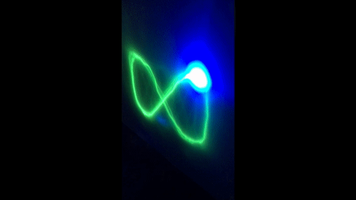

# Laser Light Show
Formerly a project with Joe Muskin and Prof. Arend van der Zande at the University of Illinois at Urbana–Champaign for engineering outreach  
Currently revived as a passion project. Adding new features

## Examples

## Current Features
1. Draws user-inputted coordinates unto special light-tracing paper
2. Draws cyclic curves with amplitudes and wavelengths (in the x and y direction) that can be changed with knobs/potentiometers

## To be Implemented
1. Drawing polar curves
2. Using Python serial communication to get user input

## Media Coverage

- I-STEM Education Initiative, 3/5/2018, [Team of Educators, Students Design Flashy New Lesson Activity](http://www.istem.illinois.edu/news/ums.laser.light.html)
- UIUC News Bureau, 5/3/2018, [Laser Light Show Machine Teaches Students Math, Computer Programming](https://mechanical.illinois.edu/news/laser-light-show-machine-teaches-students-math-computer-programming)
