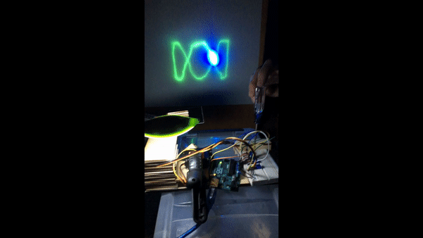
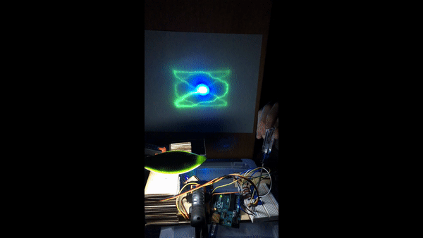

# Amplitude and Wavelength Manipulation with Knobs
Uses 4 potentiometers to increase/decrease the amplitudes and wavelengths of cyclic curves in both the x and y direction

## Examples
Changing Wavelength in x direction:

Changing Wavelength in y direction:

Changing Wavelength in both x and y directions:

Changing Amplitude in x direction:

Changing Amplitude in x direction:

