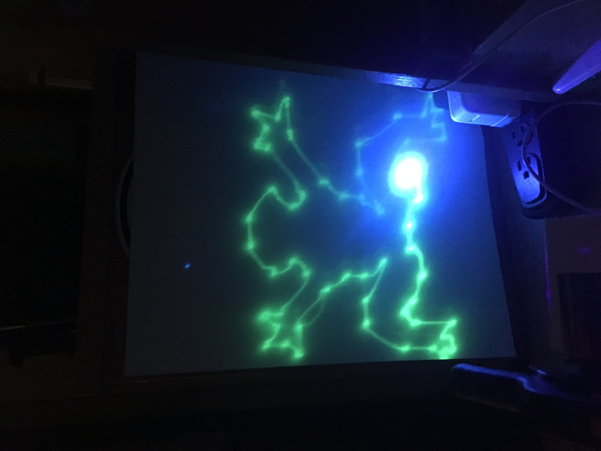

# User Input with Serial Communication (Work-in-Progress)
User can input coordinates in a Python application and those coordinates will be sent to the 
Laser Light Show using serial communication with PySerial

## Examples

